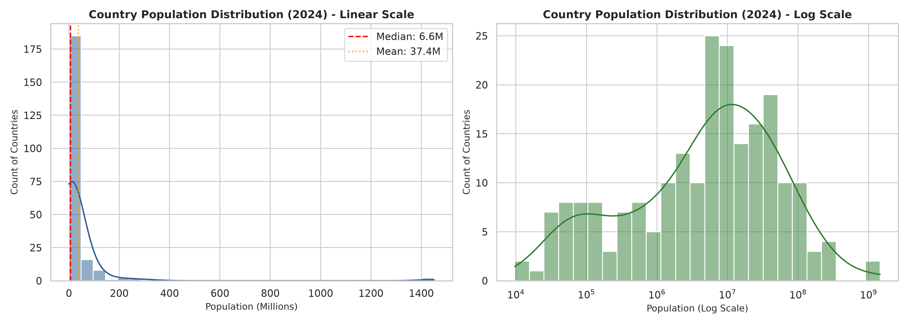
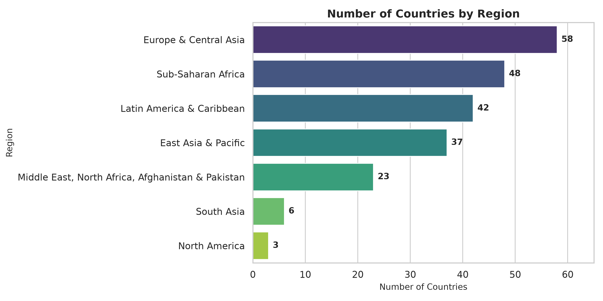
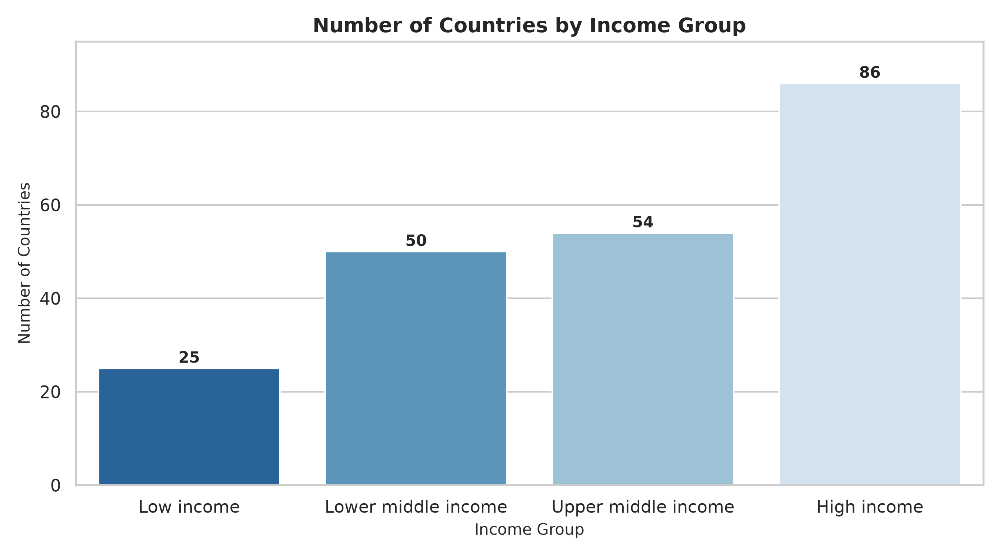
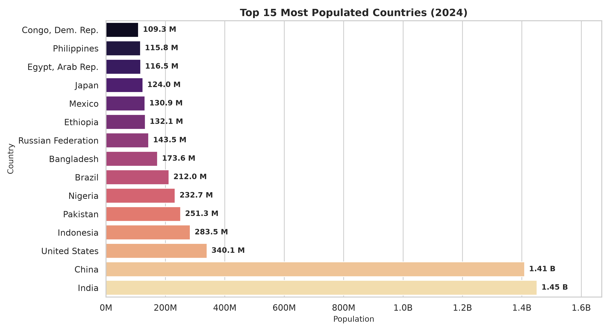
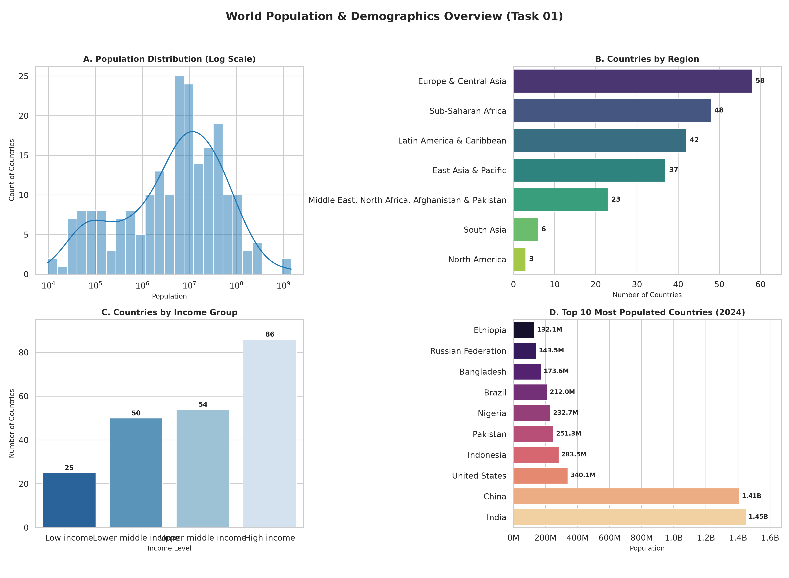

<div align="center">


# Prodigy InfoTech — Data Science Internship

### Task 01 · Population Distribution & Exploratory Analysis

<p>
  <strong>World Bank Population Dataset Analysis</strong><br>
  Data Cleaning • Exploratory Data Analysis • Visualization
</p>


</div>

---

##  Task Description

> Create a bar chart or histogram to visualize the distribution of a categorical or continuous variable, such as the distribution of ages or genders in a population.

For this task, I worked with the **World Bank Total Population** dataset and country metadata to explore population patterns across countries. I used Python-based data analysis and visualization techniques to turn the raw dataset into clear and easy-to-understand visual insights.

---


#  Visualizations

## 1. Population Distribution — Histogram & KDE

This visualization shows how population values are distributed across the countries included in the dataset.

The **linear-scale histogram** highlights the strong right-skew in country populations, while the **log-scale view** makes the distribution easier to interpret across countries with very different population sizes.

<div align="center">


### Population Distribution



</div>

---

## 2. Countries by World Bank Region

This bar chart shows the number of countries represented in each of the **7 World Bank geographic regions**.

It provides a quick comparison of how the countries in the dataset are distributed geographically.

<div align="center">


### Countries by Region



</div>

---

## 3.  Countries by Income Group

This visualization categorizes countries according to their World Bank income classification:

- Low Income
- Lower Middle Income
- Upper Middle Income
- High Income

The chart helps compare the number of countries belonging to each income group.

<div align="center">


### Countries by Income Group



</div>

---

## 4. Top 15 Most Populated Countries — 2024

This ranked bar chart highlights the **15 most populated countries in 2024**.

Population values are formatted using **Millions (M)** and **Billions (B)** to make the comparison easier to read.

<div align="center">


### Top 15 Most Populated Countries



</div>

---

## 5. Combined Summary Dashboard

For presentation purposes, all four major visualizations are also combined into a single dashboard.

This provides a quick overview of the population distribution, regional distribution, income groups, and the most populated countries.

<div align="center">


### Analysis Summary Dashboard



</div>

---


### Main Observation

The population distribution is **strongly right-skewed**. Most countries have relatively small populations, while a small number of countries have extremely large populations.

This is why the histogram looks heavily concentrated toward the lower population range, with a long tail toward the higher values.

Using a logarithmic scale provides a more balanced way to visually examine countries across a very wide range of population sizes.

---

### Steps performed

1. Loaded the World Bank population dataset using **Pandas**.
2. Inspected the structure, columns, and available records.
3. Prepared population values for analysis.
4. Combined population information with country metadata.
5. Examined country regions and income groups.
6. Calculated important population statistics.
7. Created histograms and KDE visualizations.
8. Created categorical bar charts.
9. Identified the top 15 most populated countries.
10. Saved the generated visualizations inside the `plots/` directory.

---

#  Technologies Used

<div align="center">


| Technology             | Purpose                           |
| ---------------------- | --------------------------------- |
|  **Python**            | Main programming language         |
|  **Pandas**            | Data loading, cleaning & analysis |
|  **NumPy**             | Numerical operations              |
|  **Matplotlib**        | Data visualization                |
|  **Seaborn**           | Statistical visualization         |
|  **Jupyter Notebook**  | Interactive analysis              |

</div>


---

# ▶ How to Run


```bash
python -m venv .venv
.venv\Scripts\activate
```

---

## 3. Install Dependencies

```bash
pip install -r requirements.txt
```

---

## 4. Run the Python Script

The script generates the analysis visualizations and saves them inside the `plots/` directory.

```bash
python task_01_analysis.py
```

---

## 5. Open the Jupyter Notebook

For the complete step-by-step interactive analysis:

```bash
jupyter notebook task_01_notebook.ipynb
```

You can also open the notebook using **JupyterLab**:

```bash
jupyter lab
```

---

#  Dataset

The dataset was provided as part of the **Prodigy InfoTech Data Science Internship — Task 01**.

### Source

**Prodigy InfoTech — Data Science Datasets**

https://github.com/Prodigy-InfoTech/data-science-datasets/tree/main/Task%201

The population data is based on the **World Bank Total Population** indicator.

---

#  What I Learned

Through this task, I gained practical experience in:

- Working with a real-world dataset
- Loading and inspecting CSV data
- Cleaning and preparing data for analysis
- Performing basic exploratory data analysis
- Working with continuous and categorical variables
- Creating histograms and KDE plots
- Creating and customizing bar charts
- Comparing population distributions
- Extracting meaningful insights from visualizations
- Presenting analytical results clearly

---

# Conclusion

This task provided practical experience in transforming raw population data into meaningful visual information.

The analysis shows that population sizes vary significantly between countries. While most countries have relatively small populations, a few highly populated countries account for a substantial portion of the total population. The regional and income-group visualizations also provide useful context for understanding how the countries in the dataset are distributed.

Overall, this project helped strengthen my foundation in **Python, Pandas, Exploratory Data Analysis, and Data Visualization**.

---
